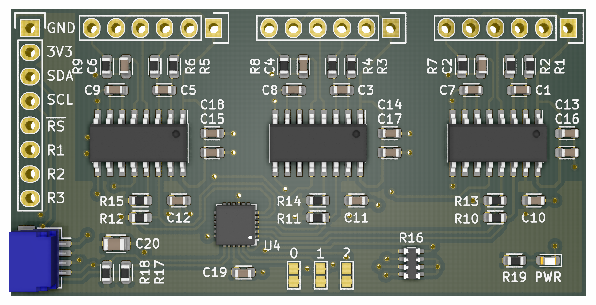

# Triaxial Load Cell Interface Breakout

Sourcing the NAU7802 seems easier than the HX711, and I2C suits my application nicely. The NAU7802 featured on [Sparkfun's Qwiic Scale breakout board](https://learn.sparkfun.com/tutorials/qwiic-scale-hookup-guide) has a hardcoded single I2C address, meaning only *one* loadcell can be put on a single I2C bus. 

I wanted to connect a triaxial load cell (3-dof, translational +- in xyz), so this breakout board puts 3x NAU7802 behind an I2C mux, a Texas Instruments TCA9548 8-channel mux (only channels 0, 1, 2 are used).

Access to the second analog channel of the NAU7802 is provided with the intent of connecting 10k NTC thermistors. This could be used for monitoring the load cell temperature (or multiple load cells if they aren't a single unit). For my application these monitor the temperatures of other elements undergoing temperature cycling.

## Hardware

A Qwiic header is included as a 'backwards compatibility layer' to the existing breakout design. If no software changes are made to Sparkfun's examples, the first channel of this board should behave identically to the single-channel Sparkfun breakout.

The 2.54mm header provides I2C, mux reset, and the ADC data-ready pins.

The solder jumpers labelled `0`, `1` and `2` change the I2C address of the I2C multiplexer. With the jumpers untouched, the address of the mux is `0x70`. These allow addresses between `0x70` to `0x77` to be used.

The general software flow is as follows:

- Telling the TCA9548 mux which output you want to use, (write `1 << channelNum` at `0x70`)
- Configure and read the NAU7802 at it's fixed base address of `0x2A`.
- Change the I2C mux to the next channel, configure and sample, repeat across channels.

Optionally, the data-ready pins of the 3 NAU7802 load cell amplifiers are exposed on the header, and these can indicate when a given load cell has completed aquisition and is ready for read-out.

### Multiple breakouts on one bus

If connecting multiple of these 3-axis boards to the same I2C bus, set the mux to a empty channel when accessing another board, as there can only be the *one* NAU7802 on the bus. By selecting an empty channel on the other breakouts, there won't be any conflicts.

